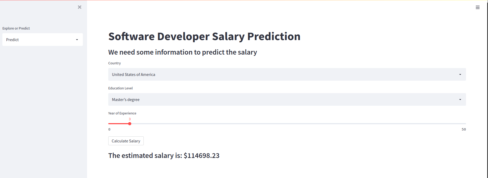

# salary-prediction-streamlit-app

## Description
Though I have been working with ML for more than 6 years, I have never been a guy who writes code for application development. But it is really great to see the output of your model in a more interactive way by a web app. I have used [```streamlit```](https://docs.streamlit.io/en/stable/api.html) for building the simple web application to visualize the salary prediction model's output trained on ```stackoverflow survey 2021``` data.

This project contains the following tasks in order

1. Load ```stackoverflow``` survey data for 2021 & clean the data
2. Build a machine learning model for predicting salary of software developer based on some parameters
3. Build a simple web application using ```streamlit``` for interacting with the ml model & predict salary
4. The web app also shows the summary visualization of software developers from the survey data



## How to execute
### Model development
For model development use the jupyter notebook in the root directory.

### Application
The ```app``` directory contains all the code for the web application.
To run the application, first install all the dependency using the ```requirements.txt``` file
```bash
pip install -r requirements.txt
```
Then run the following command-
```bash
streamlit run app.py
```
After running the command, if there is no error, open the generated localholst link in browser to use the application.


## Credits
I have followed the tutorial here for the web application part:
[Python Engineer Tutorial on ML App](https://www.youtube.com/watch?v=xl0N7tHiwlw&t=2s)